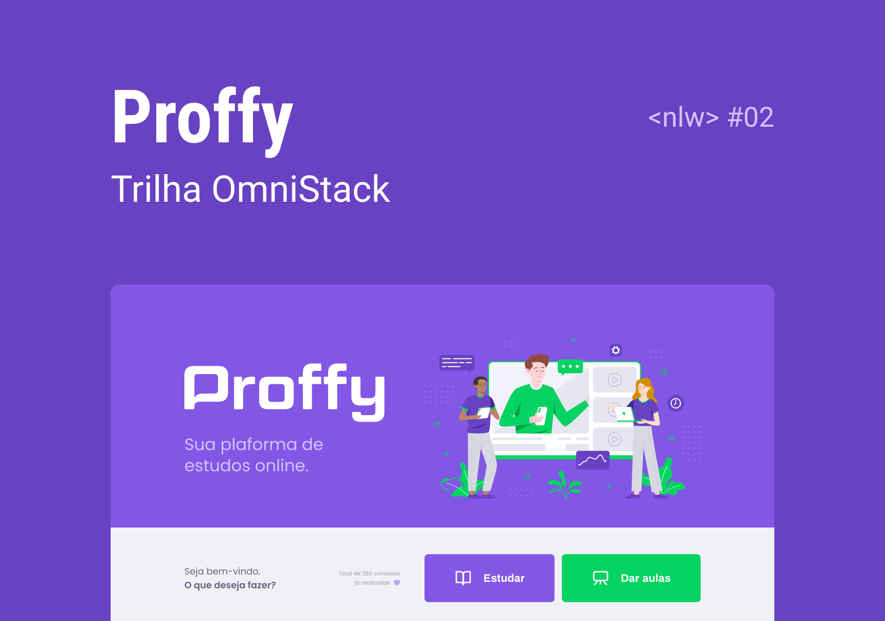

# Proffy - NLW 02

## :mortar_board: Sobre o projeto

Proffy é uma plataforma que conecta professores e alunos de todos o Brasil.

A ideia é simples, o professor se cadastra na plataforma, fornecendo as seguintes informações:

- Nome completo

- Link do avatar

- Whatsapp

- Biografia

- Matérias, sendo elas:
  - Artes
  - Biologia
  - Ciências
  - Educação física
  - Física
  - Geografia
  - História
  - Matemática
  - Português
  - Química
  
- Custo da sua hora por aula

- Horários disponíveis

Após o professor ter se cadastrado na plataforma, os alunos interessados podem buscar professores atráves dos seguintes filtros:

- Matéria

- Dia da semana

- Horário

Informando esses filtro a plataforma irá listar todos os professores que combinam com esses requisitos e assim o aluno pode se conectar com o professor atráves do whatsapp cadastrado.

## :pencil2: Design

### :iphone: Mobile

Screenshots das telas :construction:

### :computer: Web

Screenshots das telas :construction:

## :computer: Tecnologias utilizadas

- Banco de Dados: [SQLite](https://www.sqlite.org/index.html)
- Front-End: [React](https://pt-br.reactjs.org/)
- Back-End: [Typescript](https://www.typescriptlang.org/)
- Mobile: [React Native](https://reactnative.dev/)

## :arrow_forward: Executando o projeto

### Requisitos

Este projeto foi desenvolvido em React, ou seja, para executar o mesmo é necessário que você tenha instalado o [Node.JS](https://nodejs.org/en/).

### Baixando o projeto

Caso você tenha o GIT instalado em seu computador execute o comando: 

`git clone https://github.com/wiltonzanin/Proffy-NLW02.git`

Se não possuir o GIT clique no botão CODE e baixe no formato .zip

### Configurações iniciais

:construction: Em construção :construction:

### Executando o Server

:construction: Em construção :construction:

### Executando a aplicação Web

:construction: Em construção :construction:

### Executando a aplicação Mobile

:construction: Em construção :construction:

## :information_source: Versões

### Versão 1.0

A versão 1.0 consiste na versão construida durante a semana Next Level Week, ou seja, a versão mais basica da aplicação com somente as funcões principais.

:construction: Em construção :construction:

### Versão 2.0

:construction: Em construção :construction:
