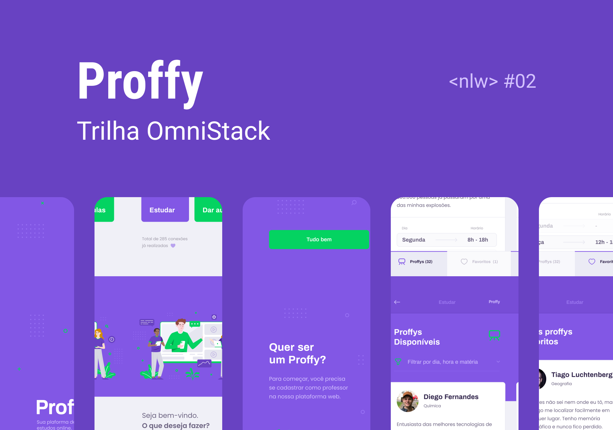
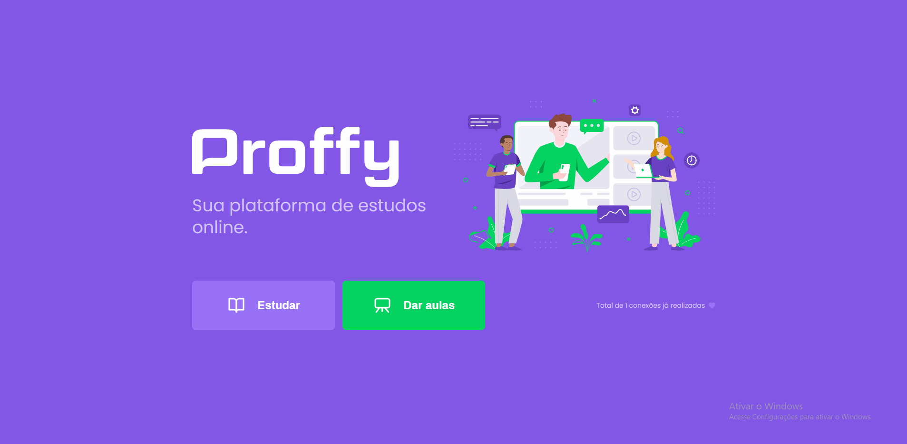

# Proffy - NLW 02

## :mortar_board: Sobre o projeto

Proffy é uma plataforma que conecta professores e alunos de todos o Brasil.

A ideia é simples, o professor se cadastra na plataforma, fornecendo as seguintes informações:

- Nome completo

- Link do avatar

- Whatsapp

- Biografia

- Matérias, sendo elas:
  - Artes
  - Biologia
  - Ciências
  - Educação física
  - Física
  - Geografia
  - História
  - Matemática
  - Português
  - Química
  
- Custo da sua hora por aula

- Horários disponíveis

Após o professor ter se cadastrado na plataforma, os alunos interessados podem buscar professores atráves dos seguintes filtros:

- Matéria

- Dia da semana

- Horário

Informando esses filtro a plataforma irá listar todos os professores que combinam com esses requisitos e assim o aluno pode se conectar com o professor atráves do whatsapp cadastrado.

## :pencil2: Design

### :iphone: Mobile

Screenshots das telas :construction:

### :computer: Web

## :computer: Tecnologias utilizadas

- Banco de Dados: [SQLite](https://www.sqlite.org/index.html)
- Front-End: [React](https://pt-br.reactjs.org/)
- Back-End: [Typescript](https://www.typescriptlang.org/)
- Mobile: [React Native](https://reactnative.dev/)

## :arrow_forward: Executando o projeto

### Requisitos

Este projeto foi desenvolvido em React, ou seja, para executar o mesmo é necessário que você tenha instalado o [Node.JS](https://nodejs.org/en/).

Para poder executar a aplicação na sua versão mobile é necessário que após a instalação do Node.js, você instale o pacote [Expo](https://expo.io/) globalmente em seu computador, seguindo os passos:

1. Abra o prompt de comando **(cmd)**
2. Digite o comando `npm install expo-cli --global`
3. Espere a instalação finalizar e feche a janela do prompt de comando.

Pronto, agora você pode utilizar os comandos do Expo em qualquer projeto existente em sua maquina.

Com o Expo instalado em seu computador, instale o app do Expo em seu celular para executar o projeto mobile Android ou IOS.

[Expo Android](https://play.google.com/store/apps/details?id=host.exp.exponent)

[Expo IOS](https://apps.apple.com/app/apple-store/id982107779)

### Baixando o projeto

Caso você tenha o GIT instalado em seu computador execute o comando: 

`git clone https://github.com/wiltonzanin/Proffy-NLW02.git`

Se não possuir o GIT clique no botão CODE e baixe no formato .zip

### Configurações iniciais

:construction: Em construção :construction:

### Executando o Server

1. Abra um terminal **(cmd)** na pasta **server**
2. O terminal irá abrir com o diretório `Diretorio onde o arquivo está salvo\Proffy-NLW02\server`
3. Digite o comando `npm install` (Esse comando irá instalar os pacotes necessários para executar o servidor)
4. Após finalizar a instalação, digite o comando `knex:migrate`, se a mensagem `Batch 1 run: 4 migrations` aparecer, significa que o banco de dados foi criado.
5. Agora, digite o comando `npm start`, se a mensagem `> server@1.0.0 start` aparecer significa que o servidor está sendo executado.

**OBS: Não feche essa janela do prompt de comando**

### Executando a aplicação Web

1. Abra um terminal **(cmd)** na pasta **web**
2. O terminal irá abrir com o diretório `Diretorio onde o arquivo está salvo\Proffy-NLW02\web`
3. Digite o comando `npm install` (Esse comando irá instalar os pacotes necessários para executar a aplicação web)
4. Após finalizar a instalação, digite o comando `npm start`. Agora aguarde alguns segundos e a aplicação web será aberta em seu navegador padrão.

**OBS: Se certifique de que o server esta rodando!"**

Agora basta explorar a aplicação WEB :wink:

### Executando a aplicação Mobile

1. Abra um terminal **(cmd)** na pasta **mobile**
2. O terminal irá abrir com o diretório `Diretorio onde o arquivo está salvo\Proffy-NLW02\mobile`
3. Digite o comando `npm install` (Esse comando irá instalar os pacotes necessários para executar a aplicação mobile)
4. Após finalizar a instalação, digite o comando `expo start`. Agora aguarde alguns segundos e será aberta uma janela do **Expo** em seu navegador padrão.

Quando a janela do **Expo** abrir, pegue o seu celular e siga os passos:

1. Abra o app do Expo no seu celular
2. Toque na opção **Scan QR Code**
3. Escaneie o QR code que aparece na **janela aberta do Expo**
4. Aguarde a aplicação mobile abrir

**OBS: Se certifique de que o server esta rodando!"**

Agora basta explorar a aplicação Mobile :wink:

## :information_source: Versões

### Versão 1.0

A versão 1.0 consiste na versão construida durante a semana Next Level Week, ou seja, a versão mais basica da aplicação com somente as funcões principais.

:construction: Em construção :construction:

### Versão 2.0

A versão 2.0 é a aplicação básica porém com mais funcionalidades para que fique mais fácil, seguro e prático de se usar a aplicação.
Essa versão é um desafio da **NLW 02** para colocar em prática os conhecimentos adquiridos ao longo da semana, segue abaixo a lista com as funcionalidades novas em relação a versão 1.0:

- [] Layout da aplicação
- [] Autenticação de usuários
- [] Recuperação de senhas
- [] Perfil do proffy
- [] Splash Screen no React Native com Expo
- [] Paginação na listagem de proffys
- [] Exibindo horários disponíveis dos proffys
- [] Salvando seus proffys favoritos
- [] Logout da aplicação
- [] Deploy da aplicação

:construction: Em construção :construction:
